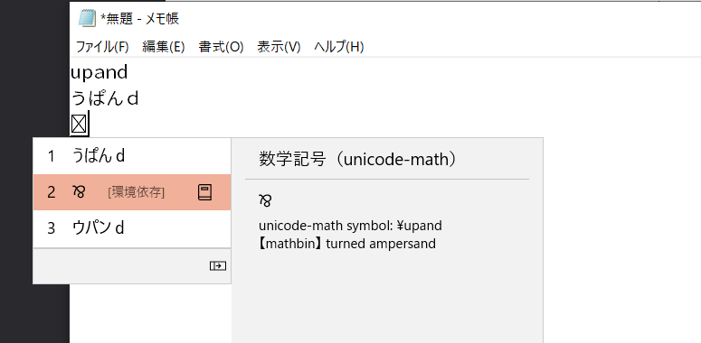

# unimath2IMEdic: type math symbols with your Japanese IME

## tl;dr
This IME dictionary enables you to type math symbols just by typing their LaTeX command names (based on [unicode-math](https://ctan.org/pkg/unicode-math)) with your Japanese IME.



## Requirements
- MS-IME. Tested with MS-IME in Windows 10 Home 21H2.

## Installation
### MS-IME
1. [Download](https://github.com/aslemen/unimath2IMEdic/releases) the latest version of the dictionary file and put it somewhere (System-wide location: `C:\Windows\IME\IMEJP\DICTS`).
2. Execute in Powershell:
    ```powershell
    C:\Windows\system32\IME\IMEJP\imjpuexc.exe `
        ADDSYSDICT `
        ${path_to_unicode-math.dic} `
        1
    ``` 

## Generating the dictionary
### Requirements
- Python ≧ 3.10
- Internet connection

### Recommendation
- The latest version of [Poetry](https://python-poetry.org/) 

### Execution
```sh
poetry env use python 3.10
poetry install
unimath2imedic ${output_path}
# or unimath2imedic - > output.txt
```
Then feed the yield of the program, which is a text file,
    to the MS-IME user dictionary tool
    and convert the entries into a system dictionary there.
See also [this instruction (by NEC, written in Japanese)](https://faq.nec-lavie.jp/qasearch/1007/app/servlet/relatedqa?QID=020883).